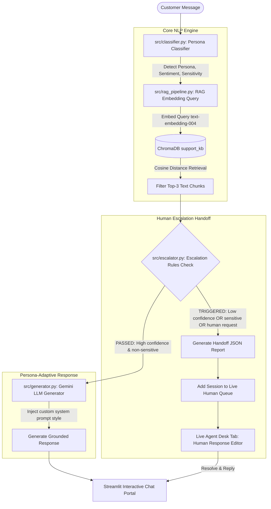

# 🤖 Persona-Adaptive Customer Support Agent (Adsparkx AI Assignment)

This repository contains the implementation of a **Persona-Adaptive Customer Support Agent** that dynamically alters its communication style and tone based on a customer's detected communication archetype. Grounded in a Retrieval-Augmented Generation (RAG) pipeline, it retrieves domain-specific documentation (from PDFs, Markdown, and TXT files) to answer queries factually, and automatically escalates critical, low-confidence, or sensitive concerns to a simulated live human representative.

---

## 🚀 Key Features

* **Real-time Persona Classification**: Maps queries using structured JSON output schemas to one of three support personas:
  * **Technical Expert**: Structured root-cause diagnostics, precise API parameters, and raw logs.
  * **Frustrated User**: Deeply empathetic validation, reassuring, simple, jargon-free bullet points.
  * **Business Executive**: Professional, brief, timeline-focused, and oriented around business/SLA impact.
* **Semantic Document Retrieval (RAG)**: Integrates persistent local **ChromaDB** with **Gemini text-embedding-004** to index support guides (including parsing complex PDF files).
* **Automated Escalation Rule Engine**: Detects low confidence (cosine similarity $< 0.45$), sensitive transactions (billing disputes, refunds, data breaches), user explicit requests, and persistent customer frustration to halt automation.
* **Live Human Handoff Simulator**: Provides a "Human-in-the-Loop" dashboard where support specialists can view escalated conversation streams, review auto-generated ticket handoff JSON reports, type custom manual replies, and resolve tickets.
* **Analytics Dashboard**: Operational widgets and interactive charts displaying query distributions, sentiment trends, average retrieval confidence, and ticket escalation rates.
* **Premium Glassmorphic Design**: Custom CSS typography (Google Fonts 'Outfit') with frosted panels, pulsing escalation alerts, and glowing color indicators reflecting classification state.

---

## 🛠️ Tech Stack

* **Programming Language**: Python 3.11+
* **User Interface**: Streamlit (v1.30.0+)
* **AI Model API**: Google Gemini API (`google-genai` SDK)
* **Embedding Model**: `text-embedding-004` (768-dimensional semantic vectors)
* **Large Language Models**: `gemini-2.5-flash` (for classification and response generation)
* **Vector Store Database**: ChromaDB (v0.4.0+ persistent local database, matching cosine distance space)
* **Chunking Algorithm**: LangChain RecursiveCharacterTextSplitter (chunk_size: 500, chunk_overlap: 50)
* **PDF Document Parsing**: PyPDF (v3.0.0+)
* **PDF Guide Generation**: ReportLab (v4.0.0+ to programmatically build the support PDF)
* **Analytics Visualization**: Pandas & Altair Charting

---

## 📐 Architecture Diagram



---

## 👤 Persona Detection Strategy

The system utilizes Gemini's structured output schema to classify the incoming query tone.

1. **System Prompt Rules**: Instruct the LLM to inspect the customer's sentiment, vocabulary density (jargon vs emotional triggers), punctuation (exclamation points, all-caps), and target business vs tech focus.
2. **Structured JSON Output**: A strict schema forces the model to return a structured JSON response:
   ```json
   {
     "persona": "Technical Expert | Frustrated User | Business Executive",
     "confidence": 0.0 - 1.0,
     "reasoning": "Detailed textual explanation of why the message matches the persona",
     "sentiment": "Positive | Neutral | Negative/Frustrated",
     "is_sensitive": true | false
   }
   ```
3. **Safety Override**: If the API call fails or times out, a deterministic regex keyword fallback in `src/classifier.py` ensures the application never crashes. Additionally, a keyword matching check maps occurrences of sensitive billing/security terms directly to `is_sensitive = True` for safety compliance.

---

## 🗃️ RAG Pipeline Design

* **Chunking Strategy**: Splitting documents as a single block wastes context tokens. The pipeline parses files (`.txt`, `.md`, `.pdf`) and uses `RecursiveCharacterTextSplitter` with a chunk size of 500 and an overlap of 50 characters. This maintains the structural context of lists and paragraphs.
* **Page Mapping**: When parsing PDFs page-by-page via `PdfReader`, the script tracks the character offsets. When chunks are generated, they are mapped to the specific PDF page number and stored in ChromaDB metadata.
* **Vector Store**: Uses ChromaDB. To match mathematical expectations, we create the collection using `"hnsw:space": "cosine"`.
* **Cosine Similarity**: Chroma queries return cosine distance $D$. We translate this to similarity using:
  $$\text{Similarity} = 1.0 - \text{Distance}$$
  Similarity is clipped to the $[0, 1]$ range and displayed in the RAG inspector.

---

## ⚠️ Escalation Logic

The conversation bypasses AI automation and escalates to a live support representative when any of the following configurable criteria are met:

1. **Low Retrieval Confidence**: The top retrieved document's similarity score is less than the threshold (`0.45`). This indicates that the knowledge base lacks information to solve the user's issue, avoiding AI hallucination.
2. **Sensitive Topic Alerts**: Immediate escalation occurs if the classifier flags a message or if the query contains payment, refund disputes, billing errors, account terminations, compliance requests, or legal keywords.
3. **Explicit Live Request**: Phrases like *"speak to a human"*, *"connect me to an agent"*, or *"talk to operator"* trigger immediate escalation.
4. **Persistent Frustration**: If the user's message is classified as `Negative/Frustrated` for three consecutive turns, the system escalates to protect user retention.

---

## 📁 Repository Directory Structure

```
c:/Users/mores/OneDrive/Desktop/Persona-Adaptive Customer Support Agent/
│
├── data/                             <-- Generated support documents
│   ├── api_troubleshooting.md        <-- Troubleshooting markdown
│   ├── billing_policy.txt            <-- Flat text policy
│   ├── password_reset_guide.pdf      <-- Programmatically built PDF guide
│   └── ...                           <-- 10 other realistic doc templates
│
├── src/                              <-- Source code folder
│   ├── __init__.py                   <-- Package initializer
│   ├── config.py                     <-- Thresholds, models, and keyword lists
│   ├── classifier.py                 <-- Structured persona classification
│   ├── rag_pipeline.py               <-- PDF reader, chunker, & ChromaDB query
│   ├── generator.py                  <-- Persona prompt generator & LLM call
│   └── escalator.py                  <-- Escalation thresholds & handoff generator
│
├── scripts/                          <-- Tool and test scripts
│   ├── generate_kb.py                <-- Knowledge base generation script
│   └── test_agent.py                 <-- Automatic testing script for verification
│
├── app.py                            <-- Premium Streamlit UI application
├── requirements.txt                  <-- Library dependencies
├── .env                              <-- Configured API credentials (ignored)
├── .env.example                      <-- Template configuration instructions
└── .gitignore                        <-- Git ignore specifications
```

---

## ⚙️ Setup & Installation Instructions

Ensure you have Python 3.11 or higher installed on your computer.

1. **Clone or Copy Repository**: Place the files inside your target directory.
2. **Create and Activate Virtual Environment**:
   ```bash
   # Windows PowerShell
   python -m venv venv
   .\venv\Scripts\Activate.ps1
   ```
3. **Install Dependencies**:
   ```bash
   pip install -r requirements.txt
   ```
4. **Configure API Keys**:
   * Rename `.env.example` to `.env` in the root folder.
   * Open `.env` and configure your API key:
     ```env
     GEMINI_API_KEY="your-actual-google-gemini-api-key"
     ```
5. **Run the Knowledge Base Document Builder**:
   This script creates the `data/` directory and writes all the standard guides (including the PDF file).
   ```bash
   python scripts/generate_kb.py
   ```
6. **Execute Core Pipeline Automated Tests**:
   Run the test script to verify that classification, RAG searches, and escalation workflows function:
   ```bash
   python scripts/test_agent.py
   ```
7. **Launch the Streamlit Web UI Dashboard**:
   ```bash
   streamlit run app.py
   ```

---

## 🔍 Verification Examples & Expected Behaviors

Test your agent with these five verification scenarios:

| Scenario | User Input | Expected Persona | Expected Behavior |
| --- | --- | --- | --- |
| **1** | *"Where is the guide to clear cookies? It's been an hour and nothing is loading on your interface!"* | **Frustrated User** | Empathizes with user, validates difficulty, and lists bulleted, easy cache clearance steps. |
| **2** | *"What are the header parameter requirements for your bearer token auth implementation?"* | **Technical Expert** | Outputs code blocks, header format requirements, and precise 401 details. |
| **3** | *"Our operational uptime is decreasing. We need a timeline of when billing disputes are resolved."* | **Business Executive** | Keeps response concise, timeline-focused, and highlights business outcomes. |
| **4** | *"I'm experiencing an issue with your database integration that's causing internal errors."* | **Technical Expert** | Retrieves context and outlines API troubleshooting steps. |
| **5** | *"My billing statement has unexpected duplicate charges. I demand an immediate refund!"* | **Frustrated User** | **Trigger Escalation**: Flags billing sensitivity, displays escalation alert, and generates JSON handoff. |

---

## ⚠️ Known Limitations & Future Roadmap

* **ChromaDB Threading in Streamlit**: Streamlit executes page reloads in multiple threads. While Chroma DB handles concurrent reads, heavy write re-indexing should only be triggered via the database administrator sidebar.
* **Token Length Limitations**: The LLM prompt template passes a maximum of three chunks. In the future, we can add a reranking model (like Cohere Rerank) to sort relevance before prompt feeding.
* **Multi-Turn Memory Storage**: The simulator captures history locally in session states. In production, this can be integrated with database tables (SQLite / PostgreSQL) to save sessions permanently.
